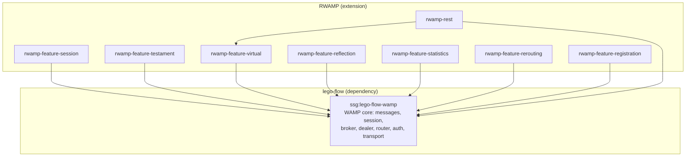

# RWAMP — Extended WAMP v2 for Java

[](https://www.oracle.com/java/)
[](https://maven.apache.org/)
[](https://gradle.org/)
[](LICENSE)

Production-grade WAMP v2 extension built on **lego-flow's WAMP implementation**.

## Overview

RWAMP extends lego-flow's WAMP core with production-grade features found in established
WAMP implementations (xLib/Autobahn):

- **Session kill** — `wamp.session.kill`, `wamp.session.killall` procedures
- **Testaments** — Scheduled procedures on session close
- **Virtual sessions** — Stateless session management for bridges
- **Reflection API** — Procedure/topic/type introspection
- **Statistics** — Call and message counters
- **REST over WAMP** — Bridge between REST and WAMP RPC
- **Call rerouting** — Cross-realm call forwarding
- **Pattern registration** — Wildcard procedure matching

## Architecture



## Building

### Maven

```bash
mvn compile
mvn test
```

### Gradle

```bash
./gradlew compileJava
./gradlew test
```

### Dependencies

Requires `ssg:lego-flow-wamp` from GitHub Packages:
```
https://maven.pkg.github.com/000ssg/lego-flow
```

For local development, install lego-flow first:
```bash
cd /path/to/lego-flow && mvn install -DskipTests
```

## Project Structure

| Module | Package | Purpose |
|--------|---------|---------|
| `rwamp-feature-session` | `ssg.rwamp.feature.session` | Session kill procedures |
| `rwamp-feature-testament` | `ssg.rwamp.feature.testament` | Testament scheduling |
| `rwamp-feature-virtual` | `ssg.rwamp.feature.virtual` | Virtual session manager |
| `rwamp-feature-reflection` | `ssg.rwamp.feature.reflection` | Introspection API |
| `rwamp-feature-statistics` | `ssg.rwamp.feature.statistics` | Statistics counters |
| `rwamp-feature-rerouting` | `ssg.rwamp.feature.rerouting` | Cross-realm forwarding |
| `rwamp-feature-registration` | `ssg.rwamp.feature.registration` | Pattern matching |
| `rwamp-rest` | `ssg.rwamp.rest` | REST over WAMP bridge |

## Development

See [AGENTS.md](AGENTS.md) for development practices and [doc/plan/](doc/plan/) for
the detailed implementation plan.

## License

MIT — see [LICENSE](LICENSE)
