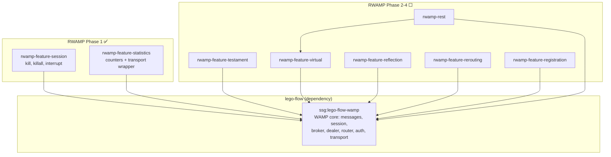

# RWAMP — Extended WAMP v2 for Java

[](https://www.oracle.com/java/)
[](https://maven.apache.org/)
[](https://gradle.org/)
[](LICENSE)

Production-grade WAMP v2 extension built on **lego-flow's WAMP implementation**.

## Overview

RWAMP extends lego-flow's WAMP core with production-grade features found in established
WAMP implementations (xLib/Autobahn):

| Feature | Module | Status |
|---------|--------|--------|
| Session kill (`wamp.session.kill*`) | `rwamp-feature-session` | ✅ Phase 1 |
| Statistics (`wamp.statistics.get`) | `rwamp-feature-statistics` | ✅ Phase 1 |
| Testaments (`wamp.session.add_testament`) | `rwamp-feature-testament` | ⬜ Phase 2 |
| Virtual sessions | `rwamp-feature-virtual` | ⬜ Phase 2 |
| Reflection API (`wamp.reflection.*`) | `rwamp-feature-reflection` | ⬜ Phase 2 |
| REST over WAMP | `rwamp-rest` | ⬜ Phase 3 |
| Call rerouting | `rwamp-feature-rerouting` | ⬜ Phase 3 |
| Pattern registration | `rwamp-feature-registration` | ⬜ Phase 4 |

## Architecture



## Building

### Maven

```bash
mvn compile
mvn test
```

### Gradle

```bash
./gradlew compileJava
./gradlew test
```

### Dependencies

Requires `ssg:lego-flow-wamp` from GitHub Packages:
```
https://maven.pkg.github.com/000ssg/lego-flow
```

For local development, install lego-flow first:
```bash
cd /path/to/lego-flow && mvn install -DskipTests
```

Both builds resolve `lego-flow-wamp:0.2.0-SNAPSHOT` from `~/.m2/repository` or
GitHub Packages (with `GITHUB_ACTOR`/`GITHUB_TOKEN`).

## Project Structure

| Module | Package | Purpose | Status |
|--------|---------|---------|--------|
| `rwamp-feature-session` | `ssg.rwamp.feature.session` | Session kill procedures | ✅ |
| `rwamp-feature-statistics` | `ssg.rwamp.feature.statistics` | Statistics counters | ✅ |
| `rwamp-feature-testament` | `ssg.rwamp.feature.testament` | Testament scheduling | ⬜ |
| `rwamp-feature-virtual` | `ssg.rwamp.feature.virtual` | Virtual session manager | ⬜ |
| `rwamp-feature-reflection` | `ssg.rwamp.feature.reflection` | Introspection API | ⬜ |
| `rwamp-feature-rerouting` | `ssg.rwamp.feature.rerouting` | Cross-realm forwarding | ⬜ |
| `rwamp-feature-registration` | `ssg.rwamp.feature.registration` | Pattern matching | ⬜ |
| `rwamp-rest` | `ssg.rwamp.rest` | REST over WAMP bridge | ⬜ |

## Quick Start

### Session Kill

```java
var router = new WampRouter();
var tracker = new SessionTransportTracker();
SessionMetaApi.register(router, tracker);

// Track session transport when created
tracker.track(sessionId, transport);

// Call wamp.session.kill from any session
// router.route(new WampMessage.Call(requestId, options, "wamp.session.kill",
//         List.of(targetSessionId)), callerTransport);
```

### Statistics

```java
var router = new WampRouter();
var stats = new WampStatistics();
StatisticsApi.register(router, stats);

// Wrap transports to count messages
var group = stats.group("myRealm");
var countingTransport = new StatisticsTransport(rawTransport, group);

// Query: call wamp.statistics.get → returns counter snapshot
```

## Development

See [AGENTS.md](AGENTS.md) for development practices and [doc/plan/](doc/plan/) for
the detailed implementation plan.

## License

MIT — see [LICENSE](LICENSE)
