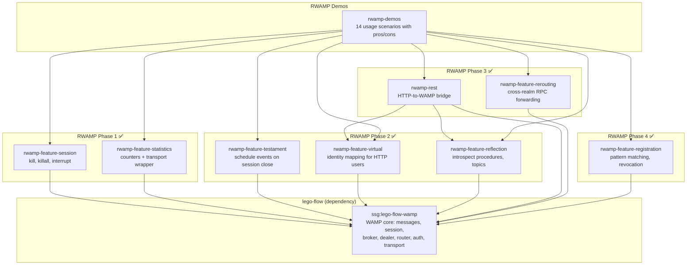

# RWAMP — Extended WAMP v2 for Java

[](https://www.oracle.com/java/)
[](https://gradle.org/)
[](LICENSE)
[]()
[]()
[]()

Production-grade WAMP v2 extension built on **lego-flow's WAMP implementation**.

## Table of Contents

- [Overview](#overview)
- [Architecture](#architecture)
- [Modules](#modules)
- [Quick Start](#quick-start)
- [Building](#building)
- [Testing & Coverage](#testing)
- [Documentation](#documentation)
- [Development](#development)
- [License](#license)

---

## Overview

RWAMP extends lego-flow's WAMP core with production-grade features found in established
WAMP implementations (xLib/Autobahn):

| Feature | Module | Phase | Status |
|---------|--------|-------|--------|
| Session kill (`wamp.session.kill*`) | `rwamp-feature-session` | 1 | ✅ Done |
| Statistics (`wamp.statistics.get`) | `rwamp-feature-statistics` | 1 | ✅ Done |
| Testaments (`wamp.session.add_testament`) | `rwamp-feature-testament` | 2 | ✅ Done |
| Virtual sessions | `rwamp-feature-virtual` | 2 | ✅ Done |
| Reflection API (`wamp.reflection.*`) | `rwamp-feature-reflection` | 2 | ✅ Done |
| REST over WAMP | `rwamp-rest` | 3 | ✅ Done |
| Call rerouting | `rwamp-feature-rerouting` | 3 | ✅ Done |
| Pattern registration | `rwamp-feature-registration` | 4 | ✅ Done |
| Usage demos & examples | `rwamp-demos` | — | ✅ Done |

---

## Architecture



---

## Modules

| Module | Package | Purpose | Tests | Coverage |
|--------|---------|---------|-------|----------|
| `rwamp-feature-session` | `ssg.rwamp.feature.session` | Session kill procedures | 12 | 91% |
| `rwamp-feature-statistics` | `ssg.rwamp.feature.statistics` | Statistics counters | 12 | 94% |
| `rwamp-feature-testament` | `ssg.rwamp.feature.testament` | Testament scheduling | 6 | 92% |
| `rwamp-feature-virtual` | `ssg.rwamp.feature.virtual` | Virtual session manager | 6 | 94% |
| `rwamp-feature-reflection` | `ssg.rwamp.feature.reflection` | Introspection API | 12 | 87% |
| `rwamp-rest` | `ssg.rwamp.rest` | REST over WAMP bridge | 10 | 80% |
| `rwamp-feature-rerouting` | `ssg.rwamp.feature.rerouting` | Cross-realm forwarding | 30 | 95% |
| `rwamp-feature-registration` | `ssg.rwamp.feature.registration` | Pattern registration & revocation | 31 | 90% |
| `rwamp-demos` | `ssg.rwamp.demo` | Usage examples & scenarios | n/a | n/a |
| **Total** | | | **197** | **91%** |

---

## Quick Start

### Session Kill

```java
var router = new WampRouter();
var tracker = new SessionTransportTracker();
SessionMetaApi.register(router, tracker);

// Track session transport when created
tracker.track(sessionId, transport);

// Call wamp.session.kill from any session
router.route(new WampMessage.Call(requestId, options, "wamp.session.kill",
        List.of(targetSessionId)), callerTransport);
```

### Reflection API

```java
var router = new WampRouter();
var registry = ReflectionApi.createRegistry(router);
ReflectionApi.register(router, registry);

// Query available procedures
router.route(new WampMessage.Call(1, Map.of(), "wamp.reflection.procedure.list", null), transport);
// → Result with list of registered procedure URIs
```

### REST over WAMP

```java
var router = new WampRouter();
var realm = new Realm("realm1");
var virtualManager = new VirtualSessionManager(realm);
var registry = ReflectionApi.createRegistry(router);

VirtualSessionApi.register(router, realm, virtualManager);
ReflectionApi.register(router, registry);

var bridge = new RestWampBridge(router, virtualManager, registry);

// Map HTTP request to WAMP call
var request = new RestRequest("GET", "/com/example/greet",
        List.of("World"), Map.of("authid", "user1"), null);
var response = bridge.handle(request);
// → RestResponse(200, ["Hello, World!"])
```

### Call Rerouting

```java
var realmManager = new RealmManager();
realmManager.createRealm("realm1");
realmManager.createRealm("realm2");

var router = new WampRouter();
ReroutingApi.register(router, realmManager);

// Call with reroute option to forward to another realm
var reroute = new LinkedHashMap<String, Object>();
reroute.put("realm", "realm2");
reroute.put("procedure", "com.example.add");
var options = new LinkedHashMap<String, Object>();
options.put("reroute", reroute);
```

### Pattern Registration

```java
var interceptor = new RegistrationInterceptor();
var router = new WampRouter();
interceptor.registerMetaProcedures(router);

// In your message loop, intercept before routing:
WampMessage response = interceptor.intercept(msg, transport);
if (response != null) {
    transport.send(response);
} else {
    router.route(msg, transport);
}

// Register a prefix pattern
interceptor.intercept(new WampMessage.Register(1,
        Map.of("match", "prefix"), "com.example."), calleeTransport);

// Register a wildcard pattern
interceptor.intercept(new WampMessage.Register(2,
        Map.of("match", "wildcard"), "com.*.bar"), calleeTransport);

// Revoke a registration
router.route(new WampMessage.Call(3, Map.of(), "wamp.registration.revoke",
        List.of(regId)), callerTransport);
```

---

## Building

### Gradle (primary)

```bash
./gradlew compileJava
./gradlew test
```

### Maven (secondary)

```bash
mvn compile -DskipTests
mvn test
```

### Dependencies

Requires `ssg:lego-flow-wamp` from GitHub Packages:
```
https://maven.pkg.github.com/000ssg/lego-flow
```

For local development, install lego-flow first:
```bash
cd /path/to/lego-flow && mvn install -DskipTests
```

Both builds resolve `lego-flow-wamp:0.2.0-SNAPSHOT` from `~/.m2/repository` or
GitHub Packages (with `GITHUB_ACTOR`/`GITHUB_TOKEN`).

---

<a id="testing"></a>
## Testing & Coverage

### Running Tests

```bash
./gradlew test --no-daemon
```

### Code Coverage

JaCoCo 0.8.14 agent is wired into all test tasks. Run coverage verification:

```bash
./gradlew clean test jacocoAggregateVerification --no-daemon
```

Coverage thresholds:
- **Aggregate**: 80% minimum (actual: 91%)
- **Per-module**: 50% minimum

Coverage by module:

| Module | Line Coverage |
|--------|--------------|
| session | 91% |
| statistics | 94% |
| testament | 92% |
| virtual | 94% |
| reflection | 87% |
| rest | 80% |
| rerouting | 95% |
| registration | 90% |
| **Aggregate** | **91%** |

---

<a id="documentation"></a>
## Documentation

### Root Documentation
- [Code Overview](doc/CODE_OVERVIEW.md) — source structure and per-module summaries
- [Architecture](doc/ARCHITECTURE.md) — architectural decisions and design patterns
- [Requirements](doc/REQUIREMENTS.md) — requirements evolution and commit history

### Per-Module Documentation

| Module | README | Architecture | Requirements | Code Overview | Compliance |
|--------|--------|-------------|--------------|---------------|------------|
| [session](rwamp-feature-session/) | [README](rwamp-feature-session/README.md) | [Architecture](rwamp-feature-session/doc/ARCHITECTURE.md) | [Requirements](rwamp-feature-session/doc/REQUIREMENTS.md) | [Code Overview](rwamp-feature-session/doc/CODE_OVERVIEW.md) | [Compliance](rwamp-feature-session/doc/COMPLIANCE.md) |
| [statistics](rwamp-feature-statistics/) | [README](rwamp-feature-statistics/README.md) | [Architecture](rwamp-feature-statistics/doc/ARCHITECTURE.md) | [Requirements](rwamp-feature-statistics/doc/REQUIREMENTS.md) | [Code Overview](rwamp-feature-statistics/doc/CODE_OVERVIEW.md) | [Compliance](rwamp-feature-statistics/doc/COMPLIANCE.md) |
| [testament](rwamp-feature-testament/) | [README](rwamp-feature-testament/README.md) | [Architecture](rwamp-feature-testament/doc/ARCHITECTURE.md) | [Requirements](rwamp-feature-testament/doc/REQUIREMENTS.md) | [Code Overview](rwamp-feature-testament/doc/CODE_OVERVIEW.md) | [Compliance](rwamp-feature-testament/doc/COMPLIANCE.md) |
| [virtual](rwamp-feature-virtual/) | [README](rwamp-feature-virtual/README.md) | [Architecture](rwamp-feature-virtual/doc/ARCHITECTURE.md) | [Requirements](rwamp-feature-virtual/doc/REQUIREMENTS.md) | [Code Overview](rwamp-feature-virtual/doc/CODE_OVERVIEW.md) | [Compliance](rwamp-feature-virtual/doc/COMPLIANCE.md) |
| [reflection](rwamp-feature-reflection/) | [README](rwamp-feature-reflection/README.md) | [Architecture](rwamp-feature-reflection/doc/ARCHITECTURE.md) | [Requirements](rwamp-feature-reflection/doc/REQUIREMENTS.md) | [Code Overview](rwamp-feature-reflection/doc/CODE_OVERVIEW.md) | [Compliance](rwamp-feature-reflection/doc/COMPLIANCE.md) |
| [rest](rwamp-rest/) | [README](rwamp-rest/README.md) | [Architecture](rwamp-rest/doc/ARCHITECTURE.md) | [Requirements](rwamp-rest/doc/REQUIREMENTS.md) | [Code Overview](rwamp-rest/doc/CODE_OVERVIEW.md) | [Compliance](rwamp-rest/doc/COMPLIANCE.md) |
| [rerouting](rwamp-feature-rerouting/) | [README](rwamp-feature-rerouting/README.md) | [Architecture](rwamp-feature-rerouting/doc/ARCHITECTURE.md) | [Requirements](rwamp-feature-rerouting/doc/REQUIREMENTS.md) | [Code Overview](rwamp-feature-rerouting/doc/CODE_OVERVIEW.md) | [Compliance](rwamp-feature-rerouting/doc/COMPLIANCE.md) |
| [registration](rwamp-feature-registration/) | [README](rwamp-feature-registration/README.md) | [Architecture](rwamp-feature-registration/doc/ARCHITECTURE.md) | [Requirements](rwamp-feature-registration/doc/REQUIREMENTS.md) | [Code Overview](rwamp-feature-registration/doc/CODE_OVERVIEW.md) | [Compliance](rwamp-feature-registration/doc/COMPLIANCE.md) |
| [demos](rwamp-demos/) | [README](rwamp-demos/README.md) | [Architecture](rwamp-demos/doc/ARCHITECTURE.md) | [Requirements](rwamp-demos/doc/REQUIREMENTS.md) | [Code Overview](rwamp-demos/doc/CODE_OVERVIEW.md) | n/a |

---

<a id="development"></a>
## Development

See [AGENTS.md](AGENTS.md) for development practices and [doc/plan/](doc/plan/) for
the detailed implementation plan.

---

## License

MIT — see [LICENSE](LICENSE)
