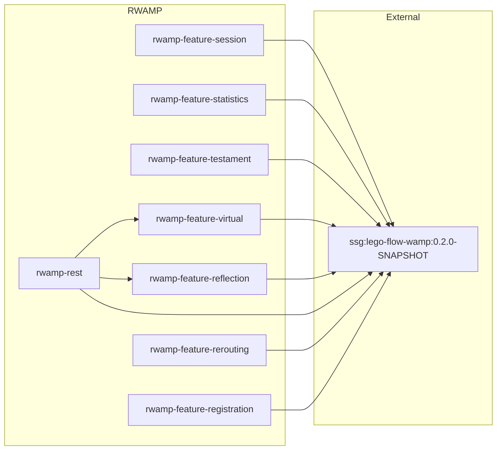

# RWAMP — Architecture

> Cross-references: [README](../README.md) | [Code Overview](CODE_OVERVIEW.md) | [Requirements](REQUIREMENTS.md)

This document describes the current architectural decisions for the RWAMP project. It is edited in place to always reflect the latest state.

---

## Project Purpose

RWAMP extends **lego-flow's WAMP v2 implementation** with production-grade features found in established WAMP deployments (xLib/Autobahn). The project re-uses lego-flow's core WAMP components — messages, session, broker, dealer, router, realm, serialization, auth, and WebSocket transport — and adds features through decorator/wrapper patterns and meta procedure registration.

## Architectural Principles

1. **Re-use over re-creation** — lego-flow's WAMP is the foundation. No WAMP-specific structures (messages, session, broker, dealer) are duplicated.
2. **No subclassing** — RWAMP never extends `Broker`, `Dealer`, or `WampRouter`. Extension uses composition and registration hooks.
3. **One-directional dependency** — RWAMP depends on lego-flow; lego-flow does not depend on RWAMP.
4. **Clean module separation** — each feature in its own module with independent compilation.
5. **Meta procedure pattern** — new WAMP procedures are registered as meta procedures on `WampRouter` using `registerMetaProcedure()`.
6. **Transport decoration** — statistics and similar cross-cutting concerns use the `WampTransport` decorator pattern.

## Dependency Model

## Design Patterns

### Meta Procedure Registration

All RWAMP features register WAMP meta procedures via `WampRouter.registerMetaProcedure(uri, handler)`. The handler is a `BiFunction<WampMessage.Call, WampTransport, List<Object>>` that produces result args. This pattern is used consistently across all modules.

### Transport Decoration

`StatisticsTransport` wraps any `WampTransport` and counts messages per type. The decorator pattern keeps the core transport unchanged while adding observability.

### Manager Objects

Stateful management classes (`TestamentManager`, `VirtualSessionManager`, `ReflectionRegistry`, `SessionTransportTracker`) hold mutable state and are injected into API classes at registration time. This follows the factory pattern — API classes are static utility classes that create handlers capturing the manager reference.

### Interceptor Pattern

`RegistrationInterceptor` sits between the transport and the router, intercepting specific message types (REGISTER, UNREGISTER, CALL with patterns) and passing the rest through. This avoids modifying the Dealer while adding pattern-based registration.

### Bridge Pattern

`RestWampBridge` composes `VirtualSessionManager` and `ReflectionRegistry` to translate HTTP requests into WAMP calls. It manages a virtual session per auth identity, reusing sessions across requests.

## Thread Safety Model

- **ConcurrentHashMap** for all shared mutable maps (`SessionTransportTracker`, `TestamentManager`, `VirtualSessionManager`)
- **Map.copyOf()** for immutable snapshots returned from getters
- **No synchronized blocks** — relying on concurrent collections and atomic operations
- **WampRouter** — single-threaded message loop assumed by lego-flow; RWAMP follows this convention

## Extension Points Used from lego-flow

| Extension Point | Used By | Purpose |
|----------------|---------|---------|
| `WampRouter.registerMetaProcedure()` | All modules | Register WAMP meta procedures |
| `WampRouter.unregisterMetaProcedure()` | All modules | Clean procedure unregistration |
| `WampRouter.addSessionLeaveConsumer()` | Testament | Auto-publish on session close |
| `WampRouter.getBroker()` | Reflection, Testament | Access broker for introspection |
| `WampRouter.getDealer()` | Reflection, Rerouting | Access dealer for introspection |
| `WampRouter.sessionJoined()` | Virtual sessions | Register virtual sessions |
| `WampRouter.sessionLeft()` | REST bridge | Clean up virtual sessions |
| `Realm.getActiveSessions()` | Session kill | Enumerate active sessions |
| `RealmManager.getRealm()` | Rerouting | Cross-realm realm lookup |

## Module Architecture Overview

### Phase 1 — Foundation

**rwamp-feature-session**: Tracks session→transport mappings and registers kill/killall/interrupt meta procedures. The `SessionTransportTracker` is the only stateful class.

**rwamp-feature-statistics**: Provides `WampStatistics` (per-realm counters) and `StatisticsTransport` (decorator). `StatisticsApi` registers the `wamp.statistics.get` meta procedure.

### Phase 2 — Discovery & Identity

**rwamp-feature-testament**: `TestamentManager` stores scheduled publications per session. `TestamentApi` hooks into session leave events to auto-publish.

**rwamp-feature-virtual**: `VirtualSessionManager` allocates session IDs and creates `WampSession` objects with auth context. `VirtualSessionApi` exposes register/unregister procedures.

**rwamp-feature-reflection**: `ReflectionRegistry` mirrors Dealer and Broker state (procedures, topics, definitions). `ReflectionApi` exposes 8 introspection procedures.

### Phase 3 — Integration

**rwamp-rest**: `RestWampBridge` maps HTTP paths to WAMP procedure URIs. Creates virtual sessions for HTTP callers and routes calls through the router. Depends on virtual sessions and reflection.

**rwamp-feature-rerouting**: `ReroutingApi` detects reroute options in CALL messages and forwards to the target realm's Dealer. Uses `RealmManager` for cross-realm lookups.

### Phase 4 — Polish

**rwamp-feature-registration**: `RegistrationInterceptor` intercepts messages before the router. `PatternRegistry` stores pattern registrations. Supports exact, prefix, and wildcard matching.

## Versioning

| Project | Version |
|---------|---------|
| lego-flow | 0.2.0-SNAPSHOT |
| RWAMP | 0.1.0-SNAPSHOT |

## Related Documentation

- [Module docs](../rwamp-feature-session/doc/ARCHITECTURE.md) (per-module)
- [lego-flow Architecture](https://github.com/000ssg/lego-flow/blob/master/doc/ARCHITECTURE.md) (upstream)

---

**Last Updated**: 2026-08-14
