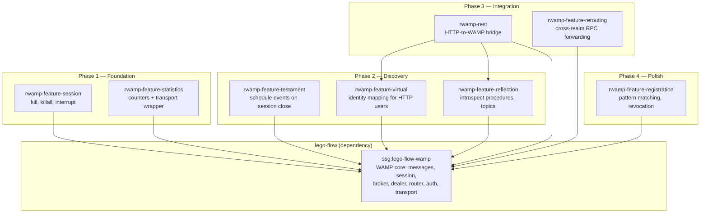

# RWAMP — Code Overview

> Cross-references: [README](../README.md) | [Architecture](ARCHITECTURE.md) | [Requirements](REQUIREMENTS.md)
>
> Per-module overviews: [rwamp-feature-session](../rwamp-feature-session/doc/CODE_OVERVIEW.md) | [rwamp-feature-statistics](../rwamp-feature-statistics/doc/CODE_OVERVIEW.md) | [rwamp-feature-testament](../rwamp-feature-testament/doc/CODE_OVERVIEW.md) | [rwamp-feature-virtual](../rwamp-feature-virtual/doc/CODE_OVERVIEW.md) | [rwamp-feature-reflection](../rwamp-feature-reflection/doc/CODE_OVERVIEW.md) | [rwamp-rest](../rwamp-rest/doc/CODE_OVERVIEW.md) | [rwamp-feature-rerouting](../rwamp-feature-rerouting/doc/CODE_OVERVIEW.md) | [rwamp-feature-registration](../rwamp-feature-registration/doc/CODE_OVERVIEW.md)

---

## Project Goals

RWAMP is a **WAMP v2 extension project** built on top of lego-flow's WAMP implementation. It provides production-grade features found in established WAMP deployments (xLib/Autobahn) without duplicating the core protocol machinery — messages, sessions, broker, dealer, router, auth, serialization, and WebSocket transport are all inherited from `ssg:lego-flow-wamp`.

**Primary design goals:**

1. **Re-use lego-flow WAMP fully** — no re-creation of WAMP-specific structures; all extensions use decorator/wrapper patterns
2. **Production-grade features** — session kill, testaments, virtual sessions, reflection API, statistics, REST bridge, call rerouting, pattern registration
3. **Clean module separation** — each feature in its own module with independent compilation
4. **Modern Java** — JDK 25 features: virtual threads, sealed interfaces, record patterns, pattern matching

---

## Module Structure

```
RWAMP/                              ← root POM / build.gradle.kts
├── rwamp-feature-session/          ← Phase 1: session kill, killall, interrupt
├── rwamp-feature-statistics/       ← Phase 1: wamp.statistics.get, counters
├── rwamp-feature-testament/        ← Phase 2: testament scheduling on session close
├── rwamp-feature-virtual/          ← Phase 2: virtual session manager for identity mapping
├── rwamp-feature-reflection/       ← Phase 2: procedure/topic/type introspection
├── rwamp-rest/                     ← Phase 3: HTTP-to-WAMP bridge
├── rwamp-feature-rerouting/        ← Phase 3: cross-realm RPC forwarding
└── rwamp-feature-registration/     ← Phase 4: pattern matching, revocation
```

Every module depends on `ssg:lego-flow-wamp` (groupId `ssg`). The `rwamp-rest` module additionally depends on `rwamp-feature-virtual` and `rwamp-feature-reflection`.

---

## Dependency Graph



---

## Layered Design

RWAMP follows a **two-layer model**:

### Layer 1 — lego-flow WAMP (dependency)

Provides the full WAMP v2 core: `WampMessage` (sealed interface with record implementations), `WampSession`, `Broker`, `Dealer`, `WampRouter`, `Realm`, client roles (`Caller`, `Callee`, `Publisher`, `Subscriber`), serialization (JSON, MessagePack, CBOR), auth (`CraAuth`, `TicketAuth`, `CryptosignAuth`), and WebSocket transport.

RWAMP uses the **extension points** added to lego-flow during Phase 0:
- `WampRouter.registerMetaProcedure()` — register meta procedure handlers
- `WampRouter.addSessionLeaveConsumer()` — hook into session lifecycle
- `Dealer.setTimeoutExecutor()` — configure call timeouts
- `Realm.getActiveSessions()` — enumerate active sessions
- `SessionState` enum — formal session lifecycle states

### Layer 2 — RWAMP Feature Modules

Each feature module uses **decorator/wrapper patterns** to extend lego-flow's components:

| Component | Approach | Example |
|-----------|----------|---------|
| Meta procedures | `registerMetaProcedure()` on WampRouter | `SessionMetaApi`, `ReflectionApi` |
| Transport wrapper | `WampTransport` decorator | `StatisticsTransport` wraps any transport |
| Manager classes | Standalone stateful objects | `TestamentManager`, `VirtualSessionManager` |
| Interceptors | Message filter before router | `RegistrationInterceptor` |
| Bridge | Higher-level facade | `RestWampBridge` composes virtual + reflection |

**Key decision: No subclassing.** RWAMP never extends `Broker`, `Dealer`, or `WampRouter`. Instead, it uses composition and the registration hooks provided by lego-flow. This keeps the dependency one-directional and allows both projects to evolve independently.

---

## Per-Module Summaries

### rwamp-feature-session

Session meta procedures (`wamp.session.kill`, `wamp.session.killall`, `wamp.session.interrupt`). Uses `SessionTransportTracker` to map session IDs to transports, enabling the kill handler to send GOODBYE to target sessions.

| Class | Purpose |
|-------|---------|
| `SessionMetaApi` | Registers/unregisters kill, killall, interrupt handlers |
| `SessionTransportTracker` | ConcurrentHashMap-backed session→transport map |

### rwamp-feature-statistics

Statistics tracking via `wamp.statistics.get` and a transport wrapper that counts messages per type.

| Class | Purpose |
|-------|---------|
| `StatisticsApi` | Registers `wamp.statistics.get` meta procedure |
| `WampStatistics` | Per-realm counters with `ProcessorStatistics`-style snapshot |
| `StatisticsTransport` | Decorator wrapping any `WampTransport` with counting |

### rwamp-feature-testament

Schedule events for publication when sessions close (e.g., last will and testament). Supports `SCOPE_DESTROYED` and `SCOPE_CLOSED` scopes.

| Class | Purpose |
|-------|---------|
| `TestamentApi` | Registers `add_testament`, `flush_testament` meta procedures + session leave hook |
| `TestamentManager` | Stores testaments per session, publishes on scope match |

### rwamp-feature-virtual

Create virtual WAMP sessions for identity mapping (e.g., HTTP users without WebSocket connections).

| Class | Purpose |
|-------|---------|
| `VirtualSessionApi` | Registers `virtual_session.register`, `virtual_session.unregister` |
| `VirtualSessionManager` | Manages virtual session allocation and auth context |

### rwamp-feature-reflection

Runtime introspection of the WAMP router: procedures, topics, types, and error definitions.

| Class | Purpose |
|-------|---------|
| `ReflectionApi` | Registers 8 meta procedures (`procedure.list`, `procedure.describe`, `topic.list`, etc.) |
| `ReflectionRegistry` | Tracks procedure/topic definitions; mirrors Dealer/Broker state |

### rwamp-rest

HTTP-to-WAMP bridge: maps REST paths to WAMP procedure URIs, creates virtual sessions for HTTP callers, and returns HTTP responses from WAMP results.

| Class | Purpose |
|-------|---------|
| `RestWampBridge` | Bridges HTTP requests to WAMP calls via virtual sessions |
| `RestRequest` | Record: method, path, pathParams, queryParams, body |
| `RestResponse` | Record: statusCode, body |

### rwamp-feature-rerouting

Cross-realm RPC forwarding. Detects `reroute` option in CALL messages and forwards to the target realm's Dealer.

| Class | Purpose |
|-------|---------|
| `ReroutingApi` | Registers `wamp.reroute.call` meta procedure |
| `ReroutingDealer` | Forwarding logic with `RealmManager` lookup |

### rwamp-feature-registration

Pattern-based procedure registration with exact, prefix, and wildcard matching. Supports registration revocation via meta procedures.

| Class | Purpose |
|-------|---------|
| `RegistrationInterceptor` | Message filter: intercepts REGISTER/UNREGISTER/CALL for patterns |
| `PatternRegistry` | Stores pattern registrations with transport references |
| `PatternMatcher` | Exact, prefix, and wildcard (single-segment `*`) matching |
| `RegistrationHandler` | Processes REGISTER/UNREGISTER messages against PatternRegistry |
| `RegistrationMetaApi` | Registers revocation and listing meta procedures |

---

## Test Strategy

- **InMemoryTransport** — each module has a local copy in test sources (lego-flow's is test-scope only)
- **Feature tests** — one test class per feature provider, paired transports
- **AssertJ assertions** — `assertThat(result).isInstanceOf(...)`
- **No transport cross-contamination** — separate InMemoryTransport pairs per session
- **Aggregate JaCoCo coverage** — 91.6% across all modules (80% gate in CI)

---

## Build System

Gradle 9.x (Kotlin DSL) is the primary build system. Both Maven POMs and Gradle coexist. JaCoCo 0.8.14 agent for coverage (Gradle 9.x removed the built-in jacoco plugin).

```bash
./gradlew clean test jacocoAggregateVerification --no-daemon
```

---

## Package Convention

All packages under `ssg.rwamp`:

| Package | Module |
|---------|--------|
| `ssg.rwamp.feature.session` | rwamp-feature-session |
| `ssg.rwamp.feature.statistics` | rwamp-feature-statistics |
| `ssg.rwamp.feature.testament` | rwamp-feature-testament |
| `ssg.rwamp.feature.virtual` | rwamp-feature-virtual |
| `ssg.rwamp.feature.reflection` | rwamp-feature-reflection |
| `ssg.rwamp.rest` | rwamp-rest |
| `ssg.rwamp.feature.rerouting` | rwamp-feature-rerouting |
| `ssg.rwamp.feature.registration` | rwamp-feature-registration |
| `ssg.rwamp.api.provider` | rwamp-api-providers |
| `ssg.rwamp.api.publisher` | rwamp-api-publishers |
| `ssg.rwamp.api.webservices` | rwamp-api-web-services |
| `ssg.rwamp.demo` | rwamp-demos |
