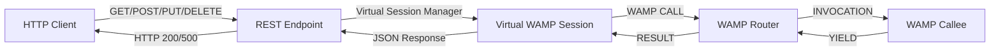

# Phase 3 — Integration

**RWAMP Phase 3:** REST over WAMP Bridge, Call Rerouting
**Effort:** 14 days
**Dependencies:** Phase 2 complete (Reflection API, Virtual Sessions)

---

## 1. Goals

After Phase 3, RWAMP has:
- **REST over WAMP bridge** — HTTP clients can call WAMP procedures and publish events
- **Virtual session integration** — HTTP-authenticated users mapped to virtual WAMP sessions
- **Call rerouting** — cross-realm RPC delegation
- **rwamp-websocket module** — WebSocket transport for router and client
- **rwamp-rest module** — REST endpoints backed by WAMP

---

## 2. REST over WAMP Bridge

**Package:** `ssg.rwamp.rest`

### 2.1 Architecture

### 2.2 REST Methods Provider
| Task | Status |
|------|--------|
| `RestWampMethodsProvider` — discovers procedures via Reflection API | ⬜ Pending |
| Auto-generate REST methods from `wamp.reflection.procedure.describe` | ⬜ Pending |
| Map HTTP method (GET/POST/PUT/DELETE) to WAMP CALL | ⬜ Pending |
| Extract path parameters → WAMP positional args | ⬜ Pending |
| Extract query/body parameters → WAMP keyword args | ⬜ Pending |

### 2.3 Virtual Session Integration
| Task | Status |
|------|--------|
| `VirtualSessionManager` in REST module — manages per-user virtual sessions | ⬜ Pending |
| HTTP auth → virtual session creation (on first request) | ⬜ Pending |
| Virtual session reuse (session ID from HTTP session/token) | ⬜ Pending |
| Virtual session cleanup (on HTTP session expiry) | ⬜ Pending |

### 2.4 REST Call Execution
| Task | Status |
|------|--------|
| `RestWampCaller` — WAMP Caller configured for REST bridge | ⬜ Pending |
| `invokeAsync()` — async call with HTTP callback | ⬜ Pending |
| Transform WAMP result → HTTP JSON response | ⬜ Pending |
| Transform WAMP error → HTTP error (404 for no_such_procedure, 500 for others) | ⬜ Pending |
| Call timeout propagation (HTTP timeout → WAMP timeout) | ⬜ Pending |

### 2.5 REST Publishing
| Task | Status |
|------|--------|
| POST to topic URI → WAMP PUBLISH | ⬜ Pending |
| Return publication ID in response | ⬜ Pending |

### 2.6 Tests
| Task | Status |
|------|--------|
| `RestWampBridgeTest` — GET → WAMP call → result | ⬜ Pending |
| `RestWampBridgeTest` — POST → WAMP call with body → result | ⬜ Pending |
| `RestWampBridgeTest` — no_such_procedure → 404 | ⬜ Pending |
| `RestWampBridgeTest` — virtual session creation and reuse | ⬜ Pending |
| `RestWampBridgeTest` — auth propagation from HTTP to WAMP | ⬜ Pending |
| `RestPublishTest` — POST → PUBLISH → event delivery | ⬜ Pending |

**Reference:** xLib `REST_WAMP_MethodsProvider.java`, `REST_WAMP_API_MethodsProvider.java`

---

## 3. WebSocket Transport

**Package:** `ssg.rwamp.transport.websocket`

### 3.1 Server-Side
| Task | Status |
|------|--------|
| `WebSocketWampHandler` — handles WebSocket frames, deserializes WAMP messages | ⬜ Pending |
| Session-per-connection lifecycle (join on connect, leave on disconnect) | ⬜ Pending |
| Serialization negotiation (from subprotocol) | ⬜ Pending |
| Auth challenge/response over WebSocket | ⬜ Pending |
| Integration with RealmManager — route to correct realm | ⬜ Pending |

### 3.2 Client-Side
| Task | Status |
|------|--------|
| `WebSocketWampClientHandler` — client-side WebSocket handler | ⬜ Pending |
| Session lifecycle management | ⬜ Pending |
| Auto-reconnect | ⬜ Pending |

### 3.3 Tests
| Task | Status |
|------|--------|
| `WebSocketWampHandlerTest` — frame handling | ⬜ Pending |
| `WebSocketIntegrationTest` — full client↔router cycle over WebSocket | ⬜ Pending |

**Reference:** lego-flow `WebSocketWampService.java`, `WampWebSocketHandler.java`

---

## 4. Call Rerouting

**Package:** `ssg.rwamp.router.feature.rerouting`

### 4.1 Core Implementation
| Task | Status |
|------|--------|
| `reroute` option in CALL — target realm and procedure | ⬜ Pending |
| Cross-realm transport for forwarding calls between realms | ⬜ Pending |
| Track rerouted invocations — route results back to original caller | ⬜ Pending |
| Support `reroute` via Dealer — detect reroute option, forward to target realm | ⬜ Pending |
| Handle response routing — when yield comes from rerouted realm, route back | ⬜ Pending |

### 4.2 Tests
| Task | Status |
|------|--------|
| `CallReroutingTest` — basic reroute to another realm | ⬜ Pending |
| `CallReroutingTest` — result returned to original caller | ⬜ Pending |
| `CallReroutingTest` — error returned on reroute failure | ⬜ Pending |

**Reference:** xLib `TestRPC_call_rerouting.java`, `WAMPRPCDealer.java` reroute handling

---

## 5. Phase 3 Completion Checklist

- [ ] All modules compile with Maven
- [ ] All modules compile with Gradle
- [ ] All tests pass (all phases combined)
- [ ] REST bridge can call any registered procedure via HTTP
- [ ] Virtual sessions integrate with HTTP auth
- [ ] WebSocket transport works end-to-end
- [ ] Call rerouting works across realms
- [ ] README.md updated with Phase 3 features
- [ ] Architecture diagram updated

---

## 6. Test Count Targets

| Feature | Target Tests |
|---------|-------------|
| REST over WAMP | 12+ |
| WebSocket Transport | 8+ |
| Call Rerouting | 5+ |
| **Phase 3 Total** | **25+** |
| **Cumulative (P1-P3)** | **135+** |
