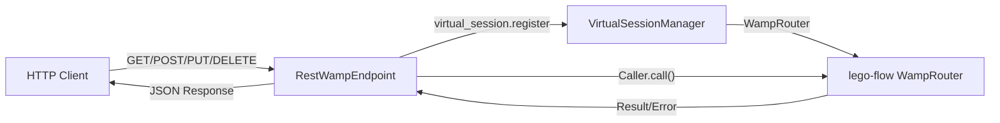

# Phase 3 — Integration

**RWAMP Phase 3:** REST over WAMP Bridge, Call Rerouting
**Effort:** 14 days
**Dependencies:** Phase 2 complete (Reflection API, Virtual Sessions)

---

## 1. Goals

After Phase 3, RWAMP has:
- **REST over WAMP bridge** — HTTP clients can call WAMP procedures and publish events
- **Virtual session integration** — HTTP-authenticated users mapped to virtual WAMP sessions
- **Call rerouting** — cross-realm RPC delegation
- **WebSocket integration** — re-uses lego-flow's WebSocket transport for end-to-end testing

---

## 2. REST over WAMP Bridge

**Package:** `ssg.rwamp.rest`

Re-uses lego-flow's `Caller` role for WAMP calls and `Subscriber` for event delivery.
Re-uses `WebSocketWampService` for the WAMP-side connection.

### 2.1 Architecture

### 2.2 REST Methods Provider
| Task | Status |
|------|--------|
| `RestWampMethodsProvider` — discovers procedures via Reflection API (Phase 2) | ⬜ Pending |
| Auto-generate REST methods from `wamp.reflection.procedure.describe` | ⬜ Pending |
| Map HTTP method (GET/POST/PUT/DELETE) to WAMP CALL | ⬜ Pending |
| Extract path parameters → WAMP positional args | ⬜ Pending |
| Extract query/body parameters → WAMP keyword args | ⬜ Pending |

### 2.3 Virtual Session Integration
| Task | Status |
|------|--------|
| `RestVirtualSessionManager` — manages per-user virtual sessions | ⬜ Pending |
| HTTP auth → virtual session creation via `virtual_session.register` | ⬜ Pending |
| Virtual session reuse (session ID from HTTP session/token) | ⬜ Pending |
| Virtual session cleanup (on HTTP session expiry) | ⬜ Pending |

### 2.4 REST Call Execution
| Task | Status |
|------|--------|
| `RestWampCaller` — uses lego-flow's `Caller` + virtual session for WAMP calls | ⬜ Pending |
| `invokeAsync()` — async call with HTTP callback | ⬜ Pending |
| Transform WAMP result → HTTP JSON response | ⬜ Pending |
| Transform WAMP error → HTTP error (404 for no_such_procedure, 500 for others) | ⬜ Pending |
| Call timeout propagation (HTTP timeout → WAMP timeout from Phase 1) | ⬜ Pending |

### 2.5 REST Publishing
| Task | Status |
|------|--------|
| POST to topic URI → WAMP PUBLISH via lego-flow's `Publisher` | ⬜ Pending |
| Return publication ID in response | ⬜ Pending |

### 2.6 Tests
| Task | Status |
|------|--------|
| `RestWampBridgeTest` — GET → WAMP call → result | ⬜ Pending |
| `RestWampBridgeTest` — POST → WAMP call with body → result | ⬜ Pending |
| `RestWampBridgeTest` — no_such_procedure → 404 | ⬜ Pending |
| `RestWampBridgeTest` — virtual session creation and reuse | ⬜ Pending |
| `RestWampBridgeTest` — auth propagation from HTTP to WAMP | ⬜ Pending |
| `RestPublishTest` — POST → PUBLISH → event delivery | ⬜ Pending |

**Reference:** xLib `REST_WAMP_MethodsProvider.java`, `REST_WAMP_API_MethodsProvider.java`

---

## 3. WebSocket Transport (Integration)

**Re-uses lego-flow's `WebSocketWampService`, `WampWebSocketHandler`, `WampWebSocketFilter`.**
No new WebSocket code needed — only integration testing.

| Task | Status |
|------|--------|
| `WebSocketIntegrationTest` — full client↔router cycle over lego-flow WebSocket | ⬜ Pending |
| `RestWampWebSocketTest` — REST bridge + WebSocket transport end-to-end | ⬜ Pending |

---

## 4. Call Rerouting

**Package:** `ssg.rwamp.feature.rerouting`

Re-uses lego-flow's `Dealer` for call handling. Adds cross-realm forwarding.

### 4.1 Core Implementation
| Task | Status |
|------|--------|
| `reroute` option in CALL — target realm and procedure | ⬜ Pending |
| `ReroutingDealer` — wraps lego-flow's `Dealer`, detects reroute option | ⬜ Pending |
| Cross-realm transport — forwards CALL to target realm's Dealer | ⬜ Pending |
| Track rerouted invocations — route results back to original caller | ⬜ Pending |
| Handle response routing — yield from rerouted realm routed back | ⬜ Pending |

### 4.2 Tests
| Task | Status |
|------|--------|
| `CallReroutingTest` — basic reroute to another realm | ⬜ Pending |
| `CallReroutingTest` — result returned to original caller | ⬜ Pending |
| `CallReroutingTest` — error returned on reroute failure | ⬜ Pending |

**Reference:** xLib `TestRPC_call_rerouting.java`, `WAMPRPCDealer.java` rerouting

**Key design decision:** Rerouting is a `ReroutingDealer` wrapper. When a CALL has
the `reroute` option, it forwards the call to the target realm's Dealer and tracks
the pending invocation to route the result back.

---

## 5. Phase 3 Completion Checklist

- [ ] All modules compile with Maven
- [ ] All modules compile with Gradle
- [ ] All tests pass (all phases combined)
- [ ] REST bridge can call any registered procedure via HTTP
- [ ] Virtual sessions integrate with HTTP auth
- [ ] WebSocket transport integration verified end-to-end
- [ ] Call rerouting works across realms
- [ ] README.md updated with Phase 3 features
- [ ] No WAMP core classes duplicated from lego-flow

---

## 6. Test Count Targets

| Feature | Target Tests |
|---------|-------------|
| REST over WAMP | 8+ |
| WebSocket Integration | 3+ |
| Call Rerouting | 5+ |
| **Phase 3 Total** | **16+** |
| **Cumulative (P1-P3)** | **55+** |
