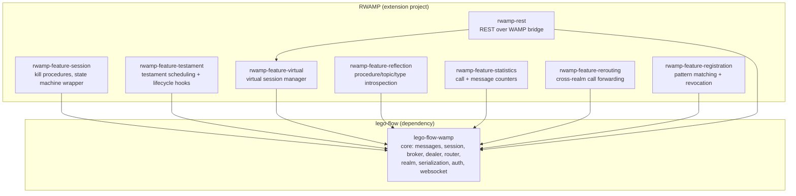

# RWAMP — Detailed Implementation Plan

**Project:** RWAMP — Extended WAMP v2 implementation for Java 25+
**Date:** 2026-08-13
**Status: In Progress (Phase 1 pending)**

---

## 1. Project Overview

RWAMP is a **WAMP v2 extension project built on top of lego-flow's WAMP implementation**.
It re-uses lego-flow's core WAMP components (messages, session, broker, dealer, router,
serialization, auth, WebSocket transport) and adds the missing production-grade features
found in xLib's WAMP implementation.

### Key Architectural Decision

**lego-flow's WAMP is the foundation, not xLib.** RWAMP depends on `ssg:lego-flow-wamp`
and extends it. No WAMP-specific structures (messages, session, broker, dealer, serialization)
should be re-created — they are re-used from lego-flow. xLib serves only as a **reference
for feature design**, not as a code source.

Where lego-flow's WAMP needs changes to support new features, those changes are proposed
for upstream inclusion in lego-flow (see Section 3).

### Goals

- **Re-use lego-flow WAMP fully** — messages, session, broker, dealer, router, realm,
  serialization, auth, WebSocket transport
- **Add xLib features missing in lego-flow** — session kill, testaments, virtual sessions,
  reflection API, call timeout, call rerouting, statistics, REST bridge
- **Avoid duplicating WAMP structures** — no parallel WampMessage, Broker, Dealer, etc.
- **Propose lego-flow changes** where graceful extension is not possible

---

## 2. Architecture

### 2.1 What RWAMP Re-uses from lego-flow

| Component | lego-flow Class | RWAMP Usage |
|-----------|----------------|-------------|
| Messages | `WampMessage` (sealed interface + 20 records) | Re-used as-is |
| Session | `WampSession` | Extended with state machine (if approved) |
| Broker | `Broker` | Re-used as-is |
| Dealer | `Dealer` | Extended with timeout/rerouting (if approved) |
| Router | `WampRouter` | Extended with kill procedures (if approved) |
| Realm | `Realm`, `RealmManager` | Re-used as-is |
| Client roles | `Caller`, `Callee`, `Publisher`, `Subscriber` | Re-used as-is |
| Serialization | JSON, MessagePack, CBOR serializers | Re-used as-is |
| Transport | `WampTransport` interface, `InMemoryTransport` | Re-used as-is |
| Auth | `CraAuth`, `TicketAuth`, `CryptosignAuth`, `WampAuthorizer` | Re-used as-is |
| WebSocket | `WebSocketWampService`, `WampWebSocketHandler` | Re-used as-is |

### 2.2 What RWAMP Adds (New Code)

| Feature | Source Inspiration | Module |
|---------|-------------------|--------|
| Session kill procedures (`wamp.session.kill*`) | xLib `WAMP_FP_SessionMetaAPI` | `rwamp-feature-session` |
| Testament API (`wamp.session.add_testament`) | xLib `WAMP_FP_TestamentMetaAPI` | `rwamp-feature-testament` |
| Virtual sessions (`virtual_session.register`) | xLib `WAMP_FP_VirtualSession` | `rwamp-feature-virtual` |
| Reflection API (`wamp.reflection.*`) | xLib `WAMP_FP_Reflection` | `rwamp-feature-reflection` |
| Statistics tracking | xLib `WAMPStatistics` | `rwamp-feature-statistics` |
| REST over WAMP bridge | xLib `REST_WAMP_MethodsProvider` | `rwamp-rest` |
| Call rerouting | xLib `WAMPRPCDealer` rerouting | `rwamp-feature-rerouting` |
| Pattern-based registration | xLib `WAMPRPCDealer` pattern | `rwamp-feature-registration` |

### 2.3 Module Structure



### 2.4 Package Structure

All packages under `ssg.rwamp`:

| Package | Purpose |
|---------|---------|
| `ssg.rwamp.feature.session` | Session kill procedures, state machine wrapper |
| `ssg.rwamp.feature.testament` | Testament manager, add/flush procedures |
| `ssg.rwamp.feature.virtual` | Virtual session manager, register/unregister |
| `ssg.rwamp.feature.reflection` | Reflection registry, procedure/topic introspection |
| `ssg.rwamp.feature.statistics` | Call and message statistics counters |
| `ssg.rwamp.feature.rerouting` | Cross-realm call forwarding |
| `ssg.rwamp.feature.registration` | Pattern-based registration, revocation |
| `ssg.rwamp.rest` | REST over WAMP bridge, virtual session integration |

---

## 3. Proposed Changes to lego-flow WAMP (For Approval)

These changes to lego-flow's `messaging/wamp` module would make extension easier
and more graceful. Each is backward-compatible (additive only).

### 3.1 WampSession — Session State Enum

**Problem:** `established` boolean is insufficient for session lifecycle tracking.
xLib has 4-state machine (`opening`, `established`, `closing`, `closed`).

**Proposed change in lego-flow:**
```java
// Add to WampSession:
public enum SessionState { OPENING, ESTABLISHED, CLOSING, CLOSED }
private SessionState state = SessionState.OPENING;
public SessionState getState() { ... }
public void setState(SessionState newState) { /* with transition validation */ }
public boolean isEstablished() { return state == SessionState.ESTABLISHED; } // backward compat
```

**Without this change:** RWAMP wraps WampSession with its own state tracking (works but
less clean — two sources of truth for session state).

**Risk:** Low. Additive, backward-compatible (`isEstablished()` stays).

### 3.2 WampRouter — Extensible Meta Procedure Registration

**Problem:** `isMetaProcedure()` and `handleMetaCall()` are hardcoded to 3 procedures.
Adding kill procedures requires modifying WampRouter.

**Proposed change in lego-flow:**
```java
// Add to WampRouter:
private final Map<String, MetaProcedureHandler> metaProcedures = new ConcurrentHashMap<>();
public void registerMetaProcedure(String procedure, MetaProcedureHandler handler) { ... }
```
Where `MetaProcedureHandler` is a `Consumer<WampMessage.Call>`.

**Without this change:** RWAMP wraps WampRouter with a subclass that overrides `route()`
(method interception — works but fragile).

**Risk:** Low. Additive, existing hardcoded procedures stay as defaults.

### 3.3 Dealer — Call Timeout Support

**Problem:** Dealer has no timeout tracking for pending calls. Call timeout is an
Advanced Profile feature.

**Proposed change in lego-flow:**
```java
// Add to Dealer:
private ScheduledExecutorService timeoutExecutor; // optional, injected
public void handleCall(WampMessage.Call call, ...) {
    // check timeout option, schedule interrupt if present
}
// Add PendingInvocation to the record: long timeoutNanos
```

**Without this change:** RWAMP intercepts CALL messages before they reach the Dealer
(wraps the router — works but duplicates routing logic).

**Risk:** Low. Additive, timeout is optional (only when `timeout` option present).

### 3.4 Realm — Active Sessions Accessor

**Problem:** `Realm` has `sessions` map (private) but no accessor for iteration.
Kill procedures need to iterate sessions.

**Proposed change in lego-flow:**
```java
// Add to Realm:
public Map<Long, WampSession> getActiveSessions() { return Map.copyOf(sessions); }
```

**Without this change:** RWAMP maintains its own session registry parallel to Realm's
(duplicates session tracking).

**Risk:** Trivial. Read-only accessor.

### 3.5 Summary of lego-flow Changes

| # | Change | Module | Effort | Needed By |
|---|--------|--------|--------|-----------|
| 1 | `SessionState` enum in `WampSession` | core | 0.5 day | Phase 1 |
| 2 | Meta procedure registration in `WampRouter` | router | 0.5 day | Phase 1 |
| 3 | Call timeout in `Dealer` | router | 1 day | Phase 1 |
| 4 | `getActiveSessions()` in `Realm` | realm | 0.25 day | Phase 1 |

**Total lego-flow changes: ~2.25 days**

---

## 4. Phase Plans

Detailed per-phase plans with step-by-step implementation tracking:

| Phase | Document | Status |
|-------|----------|--------|
| Phase 1 — Foundation | [doc/plan/PHASE_1_Foundation.md](PHASE_1_Foundation.md) | ⬜ Pending |
| Phase 2 — Discovery & Identity | [doc/plan/PHASE_2_Discovery.md](PHASE_2_Discovery.md) | ⬜ Pending |
| Phase 3 — Integration | [doc/plan/PHASE_3_Integration.md](PHASE_3_Integration.md) | ⬜ Pending |
| Phase 4 — Polish | [doc/plan/PHASE_4_Polish.md](PHASE_4_Polish.md) | ⬜ Pending |

---

## 5. Overall Progress Tracking

### Repository Setup
| Step | Status |
|------|--------|
| Create `prototype` branch from `master` | ✅ Done |
| Write plan documents | ✅ Done |
| First commit with plan | ✅ Done |

### lego-flow Changes (pending approval)
| Step | Status |
|------|--------|
| SessionState enum in WampSession | ⬜ Pending approval |
| Meta procedure registration in WampRouter | ⬜ Pending approval |
| Call timeout in Dealer | ⬜ Pending approval |
| getActiveSessions() in Realm | ⬜ Pending approval |

### Phase 1 — Foundation
| Milestone | Status |
|-----------|--------|
| Project scaffolding (POM, Gradle, AGENTS.md, dependency on lego-flow-wamp) | ⬜ Pending |
| Session Meta API (kill procedures) | ⬜ Pending |
| Call Timeout | ⬜ Pending |
| Statistics | ⬜ Pending |
| Phase 1 tests | ⬜ Pending |
| Phase 1 dual-build verification | ⬜ Pending |

### Phase 2 — Discovery & Identity
| Milestone | Status |
|-----------|--------|
| Reflection API | ⬜ Pending |
| Testament API | ⬜ Pending |
| Virtual Sessions | ⬜ Pending |
| Phase 2 tests | ⬜ Pending |
| Phase 2 dual-build verification | ⬜ Pending |

### Phase 3 — Integration
| Milestone | Status |
|-----------|--------|
| REST over WAMP bridge | ⬜ Pending |
| Call Rerouting | ⬜ Pending |
| Phase 3 tests | ⬜ Pending |
| Phase 3 dual-build verification | ⬜ Pending |

### Phase 4 — Polish
| Milestone | Status |
|-----------|--------|
| Pattern-based registration | ⬜ Pending |
| Registration revocation/meta | ⬜ Pending |
| Phase 4 tests | ⬜ Pending |
| Phase 4 dual-build verification | ⬜ Pending |
| Final documentation | ⬜ Pending |

---

## 6. Test Strategy

### Test Organization
- **Feature tests** — one test class per feature provider, using `InMemoryTransport` from lego-flow
- **Integration tests** — end-to-end flows using WebSocket transport from lego-flow
- **No duplicate tests for re-used components** — lego-flow tests cover the core

### Test Patterns (from lego-flow)
- `InMemoryTransport.createPair()` — paired transports for isolated testing
- AssertJ assertions — `assertThat(response).isInstanceOf(...)`
- Tests import lego-flow WAMP classes directly

### Required Test Coverage
- Every RWAMP feature has dedicated tests
- Integration tests verify RWAMP features work correctly on top of lego-flow components
- Statistics verified with counters before/after operations

---

## 7. Branch Strategy

| Branch | Purpose |
|--------|---------|
| `master` | Clean main branch; initial plan commit |
| `prototype` | All development; implementation commits |

---

## 8. References

- **WAMP_NEXT_STEPS.md** — Original comparison document
- **lego-flow WAMP** — `/Users/sergey.sidorov/work/projects/github/lego-flow/messaging/wamp` (basis)
- **xLib WAMP** — `/Users/sergey.sidorov/work/projects/github/xLib` (feature reference only)
- **lego-flow AGENTS.md** — Development practices to adopt

---

## 9. Effort Summary

| Item | Days |
|------|------|
| Setup + scaffolding | 2 |
| Proposed lego-flow changes (if approved) | 2.25 |
| Phase 1 — Foundation (RWAMP) | 5 |
| Phase 2 — Discovery & Identity | 13 |
| Phase 3 — Integration | 14 |
| Phase 4 — Polish | 5 |
| Buffer (15%) | 6 |
| **Total** | **47.25** |

**~47 working days (6-8 weeks at 1 person)**
