# RWAMP — Detailed Implementation Plan

**Project:** RWAMP (Robust WAMP) — Production-grade WAMP v2 implementation in Java
**Date:** 2026-08-13
**Status:** Planning

---

## 1. Project Overview

RWAMP is a standalone WAMP v2 (Web Application Messaging Protocol) implementation for Java 25+,
providing both a **router** (Broker + Dealer) and **client** (Caller/Callee/Publisher/Subscriber).
It combines the modern Java patterns of lego-flow (sealed interfaces, records, virtual threads)
with the feature completeness of xLib (30+ WAMP features including REST bridge, reflection,
testaments, virtual sessions, and statistics).

### Goals

- **Production-ready WAMP router** with all Advanced Profile features
- **Full client library** supporting all four WAMP roles
- **REST over WAMP bridge** for HTTP-to-WAMP interop
- **Modern Java codebase** — JDK 25+, sealed interfaces, records, virtual threads
- **Dual build system** — Maven + Gradle, following lego-flow conventions
- **Comprehensive test coverage** — unit tests for every feature, integration tests for end-to-end flows

### What RWAMP Is Not

- Not a general-purpose framework (unlike lego-flow) — focused solely on WAMP
- Not a port of xLib — uses lego-flow's architectural patterns, xLib is a reference only
- Not a library for embedding — designed as a standalone service or lightweight library

---

## 2. Architecture Decisions

### 2.1 Module Structure

| Module | Artifact | Purpose |
|--------|----------|---------|
| `rwamp-core` | `ssg:rwamp-core` | Core protocol: messages, session, serialization, transport interface, auth interfaces |
| `rwamp-router` | `ssg:rwamp-router` | Router: Broker, Dealer, Realm, RealmManager, feature providers, meta APIs |
| `rwamp-client` | `ssg:rwamp-client` | Client roles: Caller, Callee, Publisher, Subscriber, session lifecycle |
| `rwamp-websocket` | `ssg:rwamp-websocket` | WebSocket transport adapter for router and client |
| `rwamp-rest` | `ssg:rwamp-rest` | REST over WAMP bridge: HTTP endpoints → WAMP calls, virtual sessions |
| `rwamp-auth` | `ssg:rwamp-auth` | Authentication providers: CRA, Ticket, Cryptosign, Any |

```mermaid
graph TD
    subgraph "rwamp-core"
        C1["WampMessage (sealed interface + records)"]
        C2["WampSession (state machine)"]
        C3["WampSerializer + JSON/MsgPack/CBOR"]
        C4["WampTransport (interface)"]
        C5["Auth interfaces"]
    end

    subgraph "rwamp-router"
        R1["Broker (Pub/Sub)"]
        R2["Dealer (RPC)"]
        R3["Realm + RealmManager"]
        R4["Feature Providers"]
        R5["Session Meta API"]
        R6["Reflection API"]
        R7["Testament API"]
        R8["Virtual Sessions"]
        R9["Statistics"]
    end

    subgraph "rwamp-client"
        CL1["Caller"]
        CL2["Callee"]
        CL3["Publisher"]
        CL4["Subscriber"]
    end

    subgraph "rwamp-websocket"
        WS1["WebSocket WampTransport"]
        WS2["Router WebSocket Handler"]
        WS3["Client WebSocket Handler"]
    end

    subgraph "rwamp-rest"
        REST1["REST → WAMP bridge"]
        REST2["Virtual Session Manager"]
        REST3["HTTP Auth → WAMP identity"]
    end

    subgraph "rwamp-auth"
        A1["CRA Auth"]
        A2["Ticket Auth"]
        A3["Cryptosign Auth"]
        A4["Any Auth"]
    end

    R1 --> C1
    R2 --> C1
    R3 --> C1
    R4 --> R1
    R4 --> R2
    R5 --> R3
    R6 --> R3
    R7 --> R3
    R8 --> R3
    R9 --> R3
    CL1 --> C4
    CL2 --> C4
    CL3 --> C4
    CL4 --> C4
    WS1 --> C4
    REST1 --> CL1
    REST2 --> R8
    A1 --> C5
    A2 --> C5
    A3 --> C5
    A4 --> C5

    style C1 fill:#e1f5fe
    style C2 fill:#e1f5fe
    style C3 fill:#e1f5fe
    style C4 fill:#e1f5fe
    style C5 fill:#e1f5fe
```

### 2.2 Package Structure

**rwamp-core:** `ssg.rwamp.core`
- `ssg.rwamp.core.WampMessage` — sealed interface with all 20+ message records
- `ssg.rwamp.core.WampSession` — session with full state machine
- `ssg.rwamp.core.serialization` — JSON, MessagePack, CBOR serializers
- `ssg.rwamp.core.transport.WampTransport` — transport abstraction
- `ssg.rwamp.core.auth` — auth provider interfaces

**rwamp-router:** `ssg.rwamp.router`
- `ssg.rwamp.router.Broker` — pub/sub with all advanced features
- `ssg.rwamp.router.Dealer` — RPC with all advanced features
- `ssg.rwamp.router.Realm` / `RealmManager` — multi-realm support
- `ssg.rwamp.router.feature` — feature providers (meta, reflection, testament, virtual)
- `ssg.rwamp.router.stat` — statistics tracking

**rwamp-client:** `ssg.rwamp.client`
- `ssg.rwamp.client.Caller` / `Callee` / `Publisher` / `Subscriber`
- `ssg.rwamp.client.WampClient` — entry point combining roles + transport + session lifecycle

**rwamp-websocket:** `ssg.rwamp.transport.websocket`
- Server-side and client-side WebSocket handlers

**rwamp-rest:** `ssg.rwamp.rest`
- REST methods provider, virtual session manager, auth adapter

**rwamp-auth:** `ssg.rwamp.auth`
- `CraAuthProvider`, `TicketAuthProvider`, `CryptosignAuthProvider`, `AnyAuthProvider`

### 2.3 Key Design Principles

| Principle | Source | Description |
|-----------|--------|-------------|
| Sealed interfaces + records | lego-flow | WampMessage as sealed interface, all message types as records |
| State machine sessions | xLib | 4-state lifecycle: `opening → established → closing → closed` |
| Feature providers | xLib | Pluggable feature activation per realm (reflection, testament, etc.) |
| Virtual threads | lego-flow | Per-connection virtual thread processing |
| CompletableFuture | lego-flow | Async call/results via Future, not callbacks |
| In-memory transport for testing | lego-flow | Pair-based transport for isolated unit tests |
| No external HTTP deps in core | lego-flow | Core is transport-agnostic; HTTP/WS is separate module |

### 2.4 Build System

- **Maven** — POM hierarchy with root aggregator
- **Gradle** — `settings.gradle.kts` + `build.gradle.kts` per module
- **Java 25** — `maven.compiler.release=25`
- **groupId:** `ssg`
- **JUnit 5** — Jupiter with AssertJ + Mockito

---

## 3. Feature Inventory (from WAMP_NEXT_STEPS.md)

### Phase 1 — Foundation (Session Meta, Timeout, Statistics)
| Feature | xLib Reference | lego-flow Reference | Effort |
|---------|---------------|---------------------|--------|
| Session Meta API (kill) | `WAMP_FP_SessionMetaAPI` | `WampRouter` (partial) | 1-2 days |
| Call Timeout | `WAMPRPCDealer` | `Dealer` (no timeout) | 1-2 days |
| Statistics | `WAMPStatistics` | None | 2-3 days |
| Session state machine | `WAMPSessionState` | `WampSession` (boolean) | 1 day |

### Phase 2 — Discovery & Identity (Reflection, Testament, Virtual Sessions)
| Feature | xLib Reference | lego-flow Reference | Effort |
|---------|---------------|---------------------|--------|
| Reflection API | `WAMP_FP_Reflection` | None | 5-7 days |
| Testament API | `WAMP_FP_TestamentMetaAPI` | None | 2-3 days |
| Virtual Sessions | `WAMP_FP_VirtualSession` | None | 5-7 days |

### Phase 3 — Integration (REST Bridge, Rerouting)
| Feature | xLib Reference | lego-flow Reference | Effort |
|---------|---------------|---------------------|--------|
| REST over WAMP | `REST_WAMP_MethodsProvider` | None | 7-10 days |
| Call Rerouting | `WAMPRPCDealer` | `Dealer` (no reroute) | 3-5 days |

### Phase 4 — Polish (Pattern Registration, Revocation)
| Feature | xLib Reference | lego-flow Reference | Effort |
|---------|---------------|---------------------|--------|
| Pattern-based registration | `WAMPRPCDealer` (pattern) | `Dealer` (exact only) | 3-5 days |
| Registration revocation/meta | `WAMPRPCDealer` | `Dealer` (no revocation) | 2-3 days |

---

## 4. Phase Plans

Detailed per-phase plans with step-by-step implementation tracking:

| Phase | Document | Status |
|-------|----------|--------|
| Phase 1 — Foundation | [doc/plan/PHASE_1_Foundation.md](PHASE_1_Foundation.md) | ⬜ Pending |
| Phase 2 — Discovery & Identity | [doc/plan/PHASE_2_Discovery.md](PHASE_2_Discovery.md) | ⬜ Pending |
| Phase 3 — Integration | [doc/plan/PHASE_3_Integration.md](PHASE_3_Integration.md) | ⬜ Pending |
| Phase 4 — Polish | [doc/plan/PHASE_4_Polish.md](PHASE_4_Polish.md) | ⬜ Pending |

---

## 5. Overall Progress Tracking

### Repository Setup
| Step | Status |
|------|--------|
| Create `prototype` branch from `master` | ✅ Done |
| Write plan documents (this set) | ✅ Done |
| First commit (plan) | ⬜ Pending |

### Phase 1 — Foundation
| Milestone | Status |
|-----------|--------|
| Project scaffolding (POM, Gradle, AGENTS.md) | ⬜ Pending |
| rwamp-core module (messages, session, serialization, transport) | ⬜ Pending |
| rwamp-router module (Broker, Dealer, Realm) | ⬜ Pending |
| rwamp-client module (Caller, Callee, Publisher, Subscriber) | ⬜ Pending |
| Session state machine | ⬜ Pending |
| Session Meta API (kill procedures) | ⬜ Pending |
| Call Timeout | ⬜ Pending |
| Statistics | ⬜ Pending |
| Phase 1 tests | ⬜ Pending |
| Phase 1 dual-build verification | ⬜ Pending |

### Phase 2 — Discovery & Identity
| Milestone | Status |
|-----------|--------|
| Reflection API | ⬜ Pending |
| Testament API | ⬜ Pending |
| Virtual Sessions | ⬜ Pending |
| Phase 2 tests | ⬜ Pending |
| Phase 2 dual-build verification | ⬜ Pending |

### Phase 3 — Integration
| Milestone | Status |
|-----------|--------|
| REST over WAMP bridge | ⬜ Pending |
| Call Rerouting | ⬜ Pending |
| Phase 3 tests | ⬜ Pending |
| Phase 3 dual-build verification | ⬜ Pending |

### Phase 4 — Polish
| Milestone | Status |
|-----------|--------|
| Pattern-based registration | ⬜ Pending |
| Registration revocation/meta | ⬜ Pending |
| Phase 4 tests | ⬜ Pending |
| Phase 4 dual-build verification | ⬜ Pending |
| Final documentation | ⬜ Pending |

---

## 6. Test Strategy

### Test Organization
- **Unit tests** — per-module `src/test/java`, using `InMemoryTransport` pairs
- **Integration tests** — end-to-end flows with WebSocket transport
- **Feature tests** — one test class per feature provider

### Test Patterns (from lego-flow)
- `InMemoryTransport.createPair()` — paired transports for isolated testing
- AssertJ assertions — `assertThat(response).isInstanceOf(...)`
- Per-message routing tests — subscribe, publish, register, call, yield

### Required Test Coverage
- Every Broker/Dealer method has a dedicated test
- Every feature provider has at least 3 test cases (happy path, error, edge)
- Session state transitions tested explicitly
- Statistics counters verified after operations
- REST bridge tested with mock HTTP requests

### xLib Test Reference
| xLib Test | RWAMP Equivalent |
|-----------|-----------------|
| `TestRPC_call_rerouting` | `CallReroutingTest` |
| `TestRPC_reflection` | `ReflectionAPITest` |
| `TestRPC_testament` | `TestamentTest` |
| `Test_WAMPOrchestra` | `RestWampBridgeTest` |
| `SessionLifecycleDemoTest` | `SessionMetaKillTest` |

---

## 7. Branch Strategy

| Branch | Purpose |
|--------|---------|
| `master` | Clean main branch; initial plan commit |
| `prototype` | All development; implementation branches merge here |

Development workflow:
1. Create `prototype` from `master`
2. Implement features on `prototype` (or topic branches merged to `prototype`)
3. Each phase is a set of commits on `prototype`
4. Plan documents updated in-place as phases progress

---

## 8. References

- **WAMP_NEXT_STEPS.md** — Original comparison document with feature analysis
- **xLib WAMP** — `/Users/sergey.sidorov/work/projects/github/xLib` (reference implementation)
- **lego-flow WAMP** — `/Users/sergey.sidorov/work/projects/github/lego-flow/messaging/wamp` (pattern source)
- **lego-flow AGENTS.md** — Development practices to adopt
- **WAMP RFC** — https://wamp-proto.org/spec/wamp/

---

## 9. Effort Summary

| Phase | Days | Cumulative |
|-------|------|------------|
| Setup + scaffolding | 2 | 2 |
| Phase 1 — Foundation | 6 | 8 |
| Phase 2 — Discovery & Identity | 13 | 21 |
| Phase 3 — Integration | 14 | 35 |
| Phase 4 — Polish | 5 | 40 |
| Buffer (20%) | 8 | **48** |

**Total estimated: 40 working days (6-8 weeks at 1 person)**
