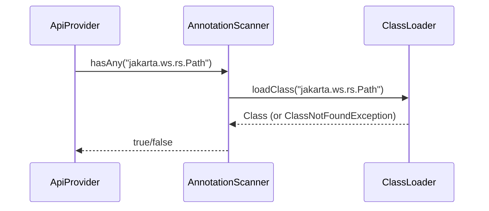
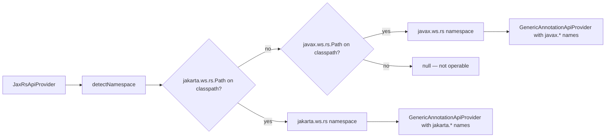

# rwamp-api-web-services — Architecture

## Module Purpose

Enable RWAMP to discover API operations from web-service annotations (JAX-RS, Jakarta EE, or any custom annotation set) using dynamic class loading. The provider gracefully degrades when annotation libraries are absent from the classpath.

## Design Philosophy

Inspired by xLib's `AnnotationsBasedMethodsProvider`, this module follows the **weak dependency** pattern:

1. Annotation class names are stored as plain strings
2. Classes are loaded at runtime via `Class.forName()` through a configurable `ClassLoader`
3. If a class is not found, the provider reports as non-operable instead of crashing
4. No compile-time dependency on the target annotation library

## Key Abstractions

### AnnotationScanner

The core utility for dynamic annotation inspection. Acts as a facade over `ClassLoader.loadClass()`:

Key features:
- Lazy loading with cache (`annotationCache` map)
- Configurable `ClassLoader` (defaults to TCCL)
- Type-safe value extraction: `getString()`, `getStringList()`, `getBoolean()`
- Convenience methods: `hasAny()`, `hasAll()`, `loadableAnnotations()`

### GenericAnnotationApiProvider

The generic engine. Accepts annotation class names as configuration and performs:

1. **Class scanning** — finds classes annotated with "type annotations"
2. **Method scanning** — finds methods annotated with "method annotations"
3. **Parameter extraction** — reads parameter annotations for metadata (source, name, description)
4. **Inference** — deduces parameter source from annotation name (`PathParam` → PATH)
5. **Media type extraction** — reads `@Consumes`/`@Produces` equivalents
6. **Group construction** — builds `ApiGroup` keyed by path prefix

### JaxRsApiProvider

A convenience wrapper around `GenericAnnotationApiProvider` with pre-configured JAX-RS annotation names. Adds namespace auto-detection:

### Model Classes

- `WsMethod` — Carries web-service metadata: path, HTTP method, consumes/produces, roles, tags
- `WsParameter` — Carries parameter source (PATH, QUERY, HEADER, FORM, COOKIE, MATRIX, BODY)

These are supplementary to the core `ApiOperation`/`ApiParameter` model from `rwamp-api-providers`. Web-service metadata flows into the `extensions` map of the core model.

## Thread Safety

- `AnnotationScanner` cache is a plain `HashMap` — not thread-safe
- For multi-threaded use, create separate scanner instances per thread or synchronize externally
- The `GenericAnnotationApiProvider` is stateless after construction — safe for concurrent use

## Extension Points

| Extension | Purpose |
|---|---|
| Custom `ClassLoader` | Scan annotations in isolated class loaders (OSGi, plugins) |
| Custom property names | Override annotation property names (e.g. `value` vs `name`) |
| Parameter source inference | Extend `inferParameterSource()` for custom annotation patterns |
| Access annotations | Add role-based access control extraction |

---

**Last Updated**: 2026-08-15
