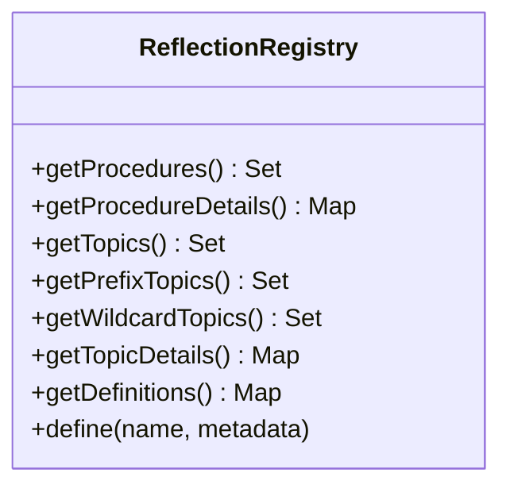

# rwamp-feature-reflection — Architecture

## Module Purpose

Provide runtime introspection of the WAMP router — listing and describing procedures, topics, and type definitions. Enables dynamic client discovery and tooling integration.

## Key Abstractions

### ReflectionRegistry

Mirrors the Dealer's procedure registry and the Broker's topic subscriptions. Maintains:
- Procedure URIs with details (callee count, options)
- Topic URIs with subscription details (subscriber count, options)
- Type/error definitions (user-defined via `wamp.reflect.define`)

### ReflectionApi

Static utility that creates handlers for 8 introspection procedures. Each handler delegates to the `ReflectionRegistry`.

## Thread Safety

- `ReflectionRegistry` uses `ConcurrentHashMap` for definitions
- Collections are returned as unmodifiable copies

## Extension Points Used

| Extension | From lego-flow | Purpose |
|-----------|---------------|---------|
| `WampRouter.getDealer()` | WampRouter | Access Dealer for procedure introspection |
| `WampRouter.getBroker()` | WampRouter | Access Broker for topic introspection |
| `WampRouter.registerMetaProcedure()` | WampRouter | Register introspection procedures |

---

**Last Updated**: 2026-08-14
