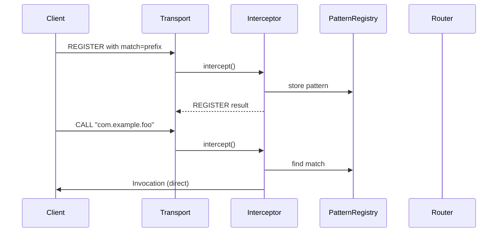

# rwamp-feature-registration — Architecture

## Module Purpose

Provide pattern-based procedure registration with exact, prefix, and wildcard matching. Enables flexible procedure dispatch without registering every procedure URI explicitly.

## Key Abstractions

### RegistrationInterceptor

Message filter placed between the transport and the router. Intercepts:
- **REGISTER** with pattern match type → stored in `PatternRegistry`
- **UNREGISTER** for a pattern registration → removed from registry
- **CALL** matching a pattern → dispatched directly to callee
- All other messages → pass through to the router

### PatternMatcher

Utility class for matching procedure URIs against patterns. Supports three modes:
- **exact** — strict equality
- **prefix** — `startsWith`
- **wildcard** — split by `.`, `*` matches one segment

### RegistrationHandler

Processes REGISTER and UNREGISTER messages. Creates registration entries with callee transport references.

### RegistrationMetaApi

Registers `wamp.registration.list` and `wamp.registration.revoke` meta procedures.

## Thread Safety

- `PatternRegistry` uses `ConcurrentHashMap` internally
- `invocations` map in `RegistrationInterceptor` uses `ConcurrentHashMap`
- `routeYield()` and `routeCalleeError()` atomically remove tracked invocations

## Extension Points Used

| Extension | From lego-flow | Purpose |
|-----------|---------------|---------|
| `WampRouter.registerMetaProcedure()` | WampRouter | Register revocation procedure |

---

**Last Updated**: 2026-08-14
