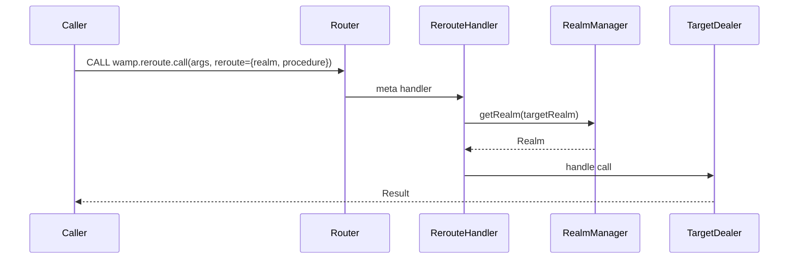

# rwamp-feature-rerouting — Architecture

## Module Purpose

Enable cross-realm RPC forwarding — detect reroute options in CALL messages and forward the call to the target realm's Dealer.

## Key Abstractions

### ReroutingApi

Registers `wamp.reroute.call` meta procedure. The handler extracts the `reroute` option from CALL messages, looks up the target realm via `RealmManager`, and forwards to the target Dealer.

### ReroutingDealer

Contains the forwarding logic that resolves the target realm and dispatches the call.

## Thread Safety

- `RealmManager` is assumed thread-safe (from lego-flow)
- Handler is stateless — no shared mutable state

## Extension Points Used

| Extension | From lego-flow | Purpose |
|-----------|---------------|---------|
| `WampRouter.registerMetaProcedure()` | WampRouter | Register reroute procedure |
| `RealmManager.getRealm()` | RealmManager | Look up target realm |
| `Realm.getDealer()` | Realm | Access target Dealer |

---

**Last Updated**: 2026-08-14
