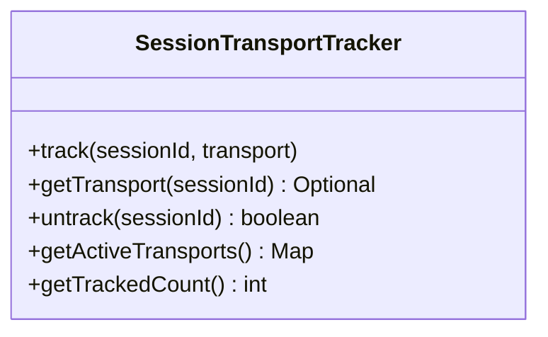
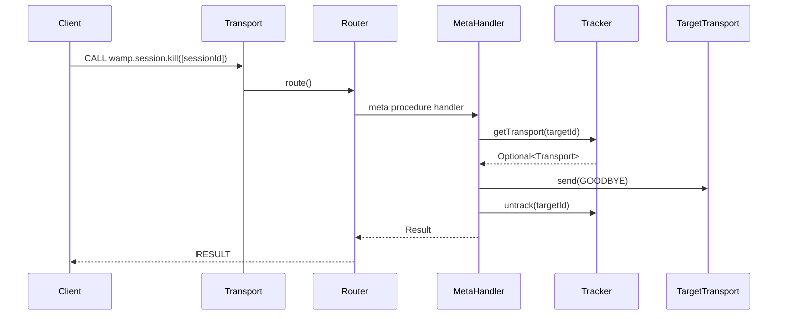

# rwamp-feature-session — Architecture

## Module Purpose

Implements WAMP Advanced Profile session meta procedures: kill, killall, and interrupt. Allows any WAMP client to request session lifecycle management from the router.

## Key Abstractions

### SessionTransportTracker
A thread-safe map from session ID to `WampTransport`. The WAMP router does not track this mapping, so the tracker fills the gap. Applications must call `track()` on session creation and `untrack()` on session close.

### SessionMetaApi
Static utility class that creates and registers meta procedure handlers. Each handler captures a reference to the `SessionTransportTracker` and implements the WAMP protocol for the respective procedure.

## Data Flow

## Thread Safety

- `SessionTransportTracker` uses `ConcurrentHashMap` internally
- `getActiveTransports()` returns an immutable snapshot via `Map.copyOf()`
- Meta procedure handlers run in the router's single-threaded message loop

## Extension Points Used

| Extension | From lego-flow | Purpose |
|-----------|---------------|---------|
| `WampRouter.registerMetaProcedure()` | WampRouter | Register kill handlers |
| `WampRouter.unregisterMetaProcedure()` | WampRouter | Clean unregistration |

---

**Last Updated**: 2026-08-14
