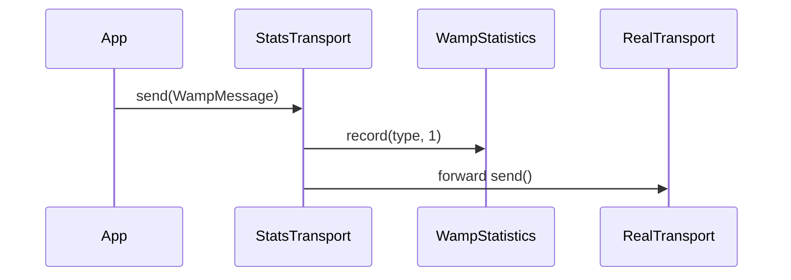

# rwamp-feature-statistics — Architecture

## Module Purpose

Provide observability for WAMP routers through message counting and a statistics query procedure.

## Key Abstractions

### WampStatistics

Per-realm counter storage using `ConcurrentHashMap<String, ProcessorStatistics>`. Each realm has its own counter set. The `snapshot()` method returns a combined view.

### StatisticsTransport

Decorator wrapping any `WampTransport`. On each `send()`, it records the message type in the appropriate realm's statistics. On `receive()`, it also counts inbound messages.

## Thread Safety

- `WampStatistics` uses `ConcurrentHashMap` internally
- `StatisticsTransport` is thread-safe via atomic counters in `WampStatistics`

## Extension Points Used

| Extension | From lego-flow | Purpose |
|-----------|---------------|---------|
| `WampRouter.registerMetaProcedure()` | WampRouter | Register statistics query |

---

**Last Updated**: 2026-08-14
