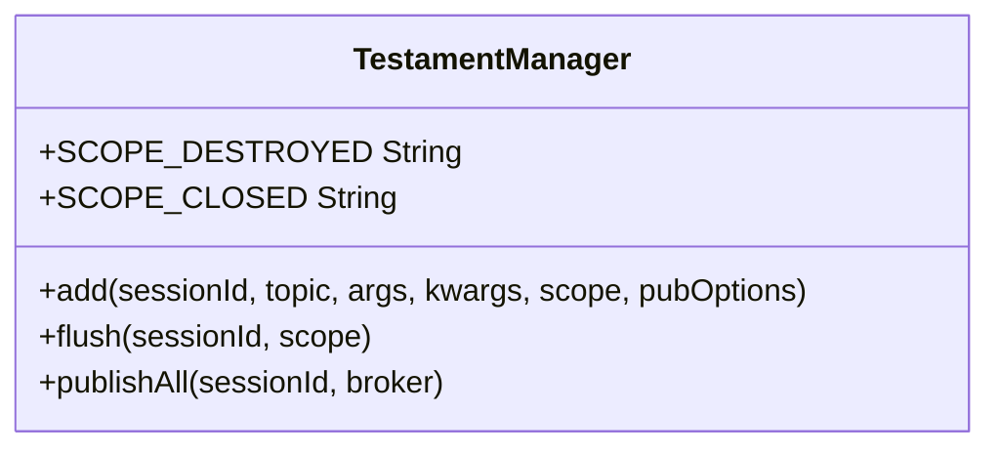
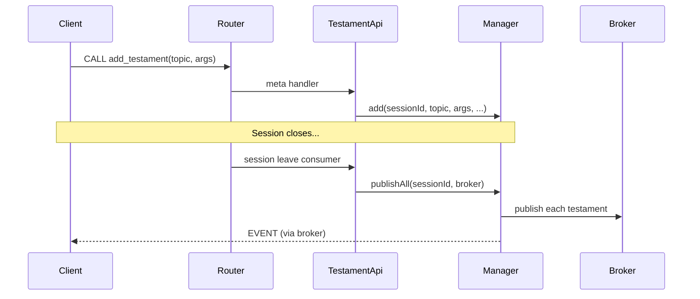

# rwamp-feature-testament — Architecture

## Module Purpose

Implement WAMP Advanced Profile testament feature — schedule events for automatic publication when sessions close (analogous to MQTT Last Will and Testament).

## Key Abstractions

### TestamentManager

Stores testaments (topic, args, kwargs, scope, publish options) per session. Supports two scopes:
- `SCOPE_DESTROYED` — publish when session is destroyed (abnormal close)
- `SCOPE_CLOSED` — publish on any session close

### TestamentApi

Hooks into `WampRouter.addSessionLeaveConsumer()` to auto-publish testaments when sessions leave. Also registers `add_testament` and `flush_testament` meta procedures.

## Data Flow

## Thread Safety

- `TestamentManager` uses `ConcurrentHashMap` for per-session testament storage
- `publishAll()` iterates and removes atomically

## Extension Points Used

| Extension | From lego-flow | Purpose |
|-----------|---------------|---------|
| `WampRouter.registerMetaProcedure()` | WampRouter | Register add/flush procedures |
| `WampRouter.addSessionLeaveConsumer()` | WampRouter | Auto-publish on session close |
| `WampRouter.getBroker()` | WampRouter | Get broker for publishing |

---

**Last Updated**: 2026-08-14
