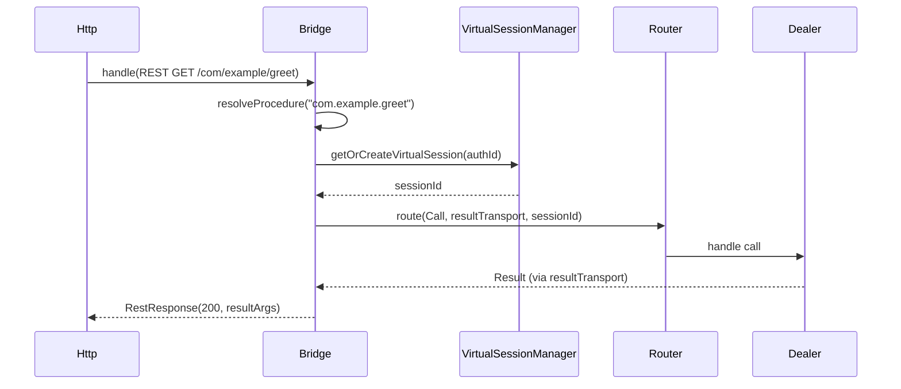

# rwamp-rest — Architecture

## Module Purpose

Bridge HTTP REST requests to WAMP calls. Translates HTTP method + path to WAMP procedure URIs, manages virtual sessions for HTTP callers, and returns HTTP responses from WAMP results.

## Key Abstractions

### RestWampBridge

The central bridge component. Maintains:
- Reference to the WAMP router (for routing calls)
- `VirtualSessionManager` (for identity mapping)
- `ReflectionRegistry` (for procedure discovery)
- `authIdToSession` map (session reuse per auth identity)

### RestRequest / RestResponse

Records modeling HTTP requests and responses:
- `RestRequest`: method, path, pathParams, queryParams, body
- `RestResponse`: statusCode, body

## Thread Safety

- `authIdToSession` is a `ConcurrentHashMap`
- `computeIfAbsent` for session creation ensures thread-safe session reuse

## Extension Points Used

| Extension | From RWAMP | Purpose |
|-----------|-----------|---------|
| `VirtualSessionManager` | rwamp-feature-virtual | Identity mapping for HTTP callers |
| `ReflectionRegistry` | rwamp-feature-reflection | Procedure discovery |
| `WampRouter.route()` | lego-flow | Execute WAMP calls |

---

**Last Updated**: 2026-08-14
